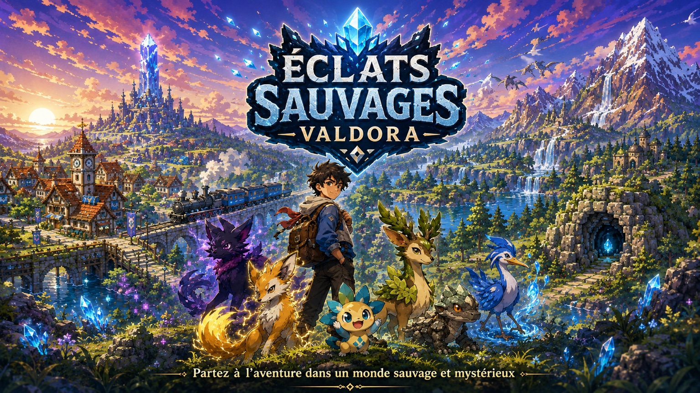

# Éclats Sauvages — Valdora



Jeu d’aventure et de collection de créatures se déroulant dans la région de Valdora. La version actuelle est la **V118 — Monde vivant**.

## Jouer

### Sur Windows

1. Télécharge la dernière archive depuis la page **Releases** du dépôt.
2. Décompresse entièrement l’archive.
3. Lance `JOUER_VALDORA.bat`.

La version de création et de diagnostic est accessible avec `CREATOR_VALDORA.bat`.

### Confidentialité du dépôt

Cette édition GitHub est prévue pour un dépôt **privé**. GitHub Pages n’est pas activé afin de ne pas publier le jeu sur le Web. Les personnes autorisées peuvent récupérer le dépôt ou télécharger l’archive Windows depuis une Release privée.

Consulte [PUBLICATION_GITHUB.md](PUBLICATION_GITHUB.md) pour la première publication et l’ajout éventuel de collaborateurs.

## V118 — Monde vivant

- 210 habitants extérieurs répartis dans les 15 villes.
- PNJ mobiles, orientés et séparés les uns des autres.
- Maisons habitées et bâtiments publics peuplés.
- 1 440 dialogues contextuels uniques.
- 60 activités secondaires « Vie locale ».
- Animations d’ambiance et indications d’interaction.
- Implantation des bâtiments contrôlée par rapport aux routes.
- Versions Joueur et Créateur vérifiées sans erreur de démarrage.

Le rapport complet est disponible dans [RAPPORT_V118.md](RAPPORT_V118.md).

## Organisation du dépôt

| Chemin | Contenu |
| --- | --- |
| `game/` | Jeu complet, pages HTML, scripts, graphismes, sons et musiques |
| `creator/` | Informations relatives à l’édition Créateur |
| `.github/workflows/` | Vérification automatique de l’intégrité du dépôt |
| `outils/` | Vérification et génération des manifestes |
| `JOUER_VALDORA.bat` | Lancement de l’édition Joueur sous Windows |
| `CREATOR_VALDORA.bat` | Lancement de l’édition Créateur sous Windows |
| `ARBORESCENCE_GITHUB.txt` | Nomenclature complète des fichiers du dépôt |
| `MANIFESTE_SHA256.csv` | Chemins, tailles et empreintes des fichiers |

Git ne transmet pas des dossiers comme objets indépendants. Il transmet chaque fichier avec son chemin ; GitHub recrée donc automatiquement `game/assets/...`, `.github/workflows/...` et toute l’arborescence. Les dossiers vides ne sont pas conservés, mais ce projet n’en dépend pas.

## Sauvegardes

Les sauvegardes `.valdora` sont personnelles et exclues du dépôt. Pour transférer une partie, utilise l’export et l’import depuis l’écran d’accueil du jeu.

## Vérifier le dépôt

```text
python outils/verifier_depot.py
```

Ce contrôle vérifie les fichiers indispensables, les liens directs des pages HTML, la casse des chemins et la limite de taille de GitHub.

## Propriété intellectuelle

Ce dépôt n’est pas distribué sous une licence libre. Le code, les graphismes, les personnages, les musiques, les noms et l’univers sont protégés. Consulte [LICENSE.md](LICENSE.md).
